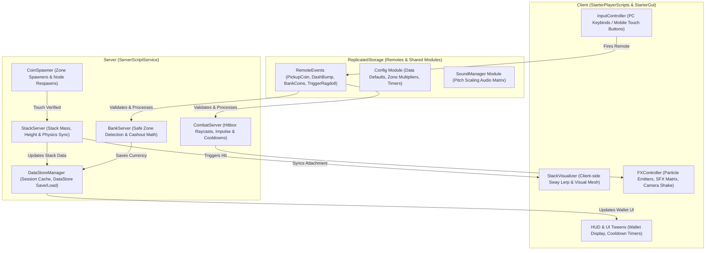
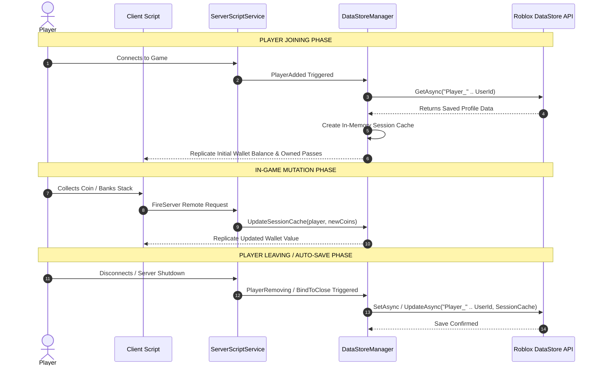
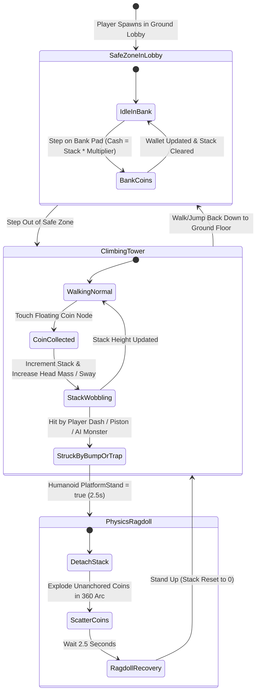

# 📐 DON'T DROP THE COIN! — SYSTEM ARCHITECTURE & TECHNICAL DOCUMENTATION

This document provides a comprehensive technical overview of the system architecture, data flow, server-client networking, and state machine diagrams for **Don't Drop The Coin!**.

---

## 🏗️ 1. OVERALL SYSTEM ARCHITECTURE

---

## 💾 2. DATASTORE & SESSION DATA FLOW

---

## 🌀 3. CORE GAMEPLAY STATE MACHINE

---

## 📡 4. SERVER-CLIENT NETWORK CONTRACT (REMOTES)

| Remote Name | Type | Direction | Description |
| --- | --- | --- | --- |
| `PickupCoin` | `RemoteEvent` | Client $\rightarrow$ Server | Fired when client touches a floating coin node. Server validates distance & updates stack. |
| `DashBump` | `RemoteEvent` | Client $\rightarrow$ Server | Fired when player presses `E` / Touch Button. Server verifies cooldown & performs hitbox check. |
| `BankCoins` | `RemoteEvent` | Client $\rightarrow$ Server | Fired when player steps on Bank Pad. Server calculates multiplier & saves to DataStore. |
| `UpdateHUD` | `RemoteEvent` | Server $\rightarrow$ Client | Sent to client to update wallet counter, stack height meter, and UI bounce animations. |
| `PlayVFX` | `RemoteEvent` | Server $\rightarrow$ Client | Replicates sound pitch effects, particle sparkles, and camera shake to nearby clients. |
| `PlaySound` | `RemoteEvent` | Server $\rightarrow$ Client | Broadcasts 2D UI or 3D spatial sound triggers to target clients or all clients. |
