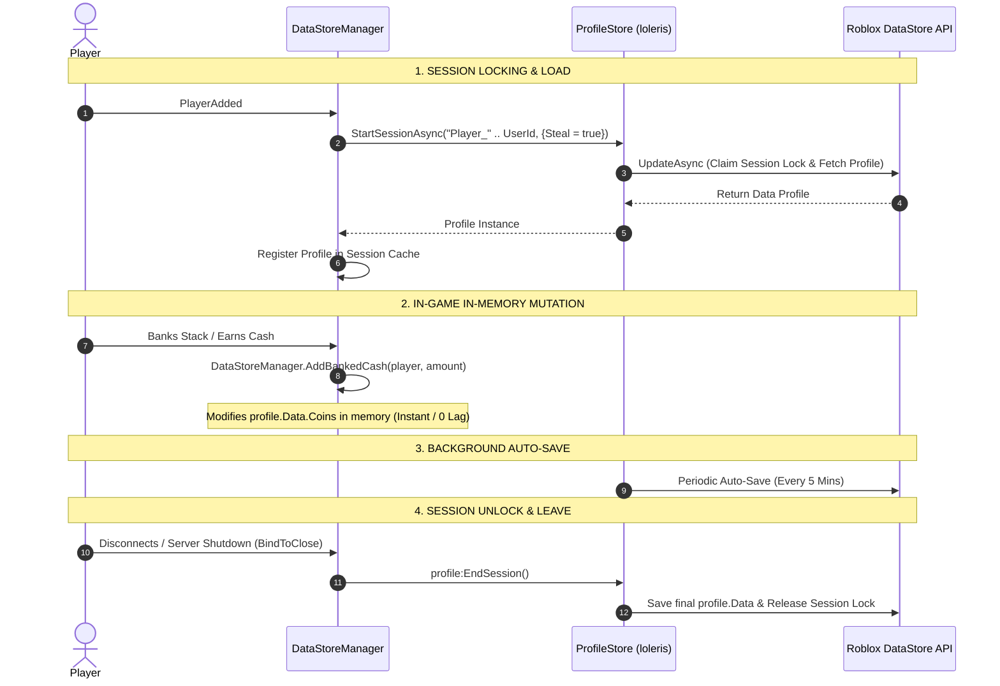

# 📄 SYSTEM 01: DATASTORE & GAME CONFIGURATION (ProfileStore)

This document specifies the data schema, configuration parameters, and server-side session management using **loleris's ProfileStore** for **Don't Drop The Coin!**.

---

## 🎯 OBJECTIVES
1. Provide a single source of truth for game constants (`src/shared/Config.luau`).
2. Manage player data persistence safely using **`ProfileStore`** (`src/server/DataManager/ProfileStore.luau`) with session locking, automatic schema reconciliation, pcall protection, auto-save timers, and `BindToClose` handling in `src/server/DataStoreManager.luau`.

---

## 📐 DATA SCHEMA (`Config.DEFAULT_DATA`)

```luau
{
    Coins = 0,             -- Permanent wallet cash banked
    TotalBanked = 0,       -- Lifetime total cash banked (for leaderboards)
    EquippedSkin = "Default",
    OwnedPasses = {},      -- Table of owned gamepass IDs
    LastSaved = 0          -- Unix timestamp of last successful save
}
```

---

## ⚙️ CONFIGURATION CONSTANTS (`Config.luau`)

| Category | Parameter | Value | Description |
| --- | --- | --- | --- |
| **Data** | `DATASTORE_KEY` | `"DontDropTheCoin_v1"` | Master ProfileStore DataStore key name |
| **Data** | `AUTO_SAVE_INTERVAL` | `300` (seconds) | Background auto-save frequency in ProfileStore |
| **Encumbrance** | `ENCUMBRANCE.BASE_WALKSPEED` | `16` (studs/s) | Standard default humanoid movement speed |
| **Encumbrance** | `ENCUMBRANCE.MIN_WALKSPEED` | `8` (studs/s) | Maximum 50% slowdown cap to preserve jump viability |
| **Encumbrance** | `ENCUMBRANCE.WEIGHT_PENALTY_FACTOR` | `0.02` | Speed reduction per unit of total stack weight |
| **Stack** | `MAX_RENDER_STACK` | `30` | Max physical coin parts rendered above head |
| **Stack** | `STACK_FOLLOW_HEAD_ROTATION` | `false` | Keeps coin stack upright aligned with body orientation |
| **Combat** | `BUMP_COOLDOWN` | `5` (seconds) | Cooldown duration for Dash Bump ability |
| **Combat** | `RAGDOLL_DURATION` | `2.5` (seconds) | Time player remains in ragdoll state when hit |
| **Group** | `GROUP_ID` | `0` *(Placeholder)* | Roblox Group ID for loyalty gate check |
| **Group** | `GROUP_CASH_MULTIPLIER` | `1.20` (+20%) | Permanent cash multiplier for group members |

---

## 🪙 ZONE TIER & PROGRESSION MATRIX (`Config.ZONE_TIERS`)

| Tier | Name | Cash Multiplier | Weight (per coin) | Neon Visual Color | Model Asset |
| :---: | :---: | :---: | :---: | :---: | :---: |
| **1** | Bronze | **1.00x** | **1.0** | Gold Neon `(255, 215, 0)` | `Coin_Tier1` |
| **2** | Silver | **1.25x** | **1.2** | Cyan Neon `(0, 230, 255)` | `Coin_Tier2` |
| **3** | Gold | **1.50x** | **1.5** | Deep Gold `(255, 180, 0)` | `Coin_Tier3` |
| **4** | Emerald | **1.75x** | **1.8** | Emerald Green `(50, 230, 90)` | `Coin_Tier4` |
| **5** | Sapphire | **2.00x** | **2.2** | Sapphire Blue `(30, 140, 255)` | `Coin_Tier5` |
| **6** | Ruby | **2.25x** | **2.6** | Ruby Red `(255, 45, 70)` | `Coin_Tier6` |
| **7** | Amethyst | **2.50x** | **3.0** | Purple Neon `(180, 50, 255)` | `Coin_Tier7` |
| **8** | Diamond | **2.75x** | **3.5** | Diamond Cyan `(140, 240, 255)` | `Coin_Tier8` |
| **9** | Void | **3.00x** | **4.0** | Deep Void Violet `(90, 20, 160)` | `Coin_Tier9` |
| **10** | Celestial | **3.25x** | **5.0** | Celestial White `(255, 255, 255)` | `Coin_Tier10` |

---

## 🔁 PROFILESTORE SAVING LIFECYCLE



---

## 📱 DISCONNECT & NETWORK FAILURE BEHAVIOR

| Disconnect Scenario | Server & DataStore Reaction | Player Coin Impact |
| --- | --- | --- |
| **Abrupt App Disconnect / Phone Battery Dies** | Roblox server fires `PlayerRemoving`. `DataStoreManager` executes `profile:EndSession()`, triggering `ProfileStore` to save banked cash and unlock the session instantly. | **Banked Cash:** Saved 100%.<br>**Unbanked Head Stack:** Lost (player dropped out of tower). |
| **Wi-Fi / Cellular Drop** | Server detects heartbeat timeout after 10-15s, fires `PlayerRemoving`, and performs emergency `profile:EndSession()`. | **Banked Cash:** Saved 100%.<br>**Unbanked Head Stack:** Lost. |
| **Server Crash + Phone Crash Simultaneously** | `ProfileStore` session lock remains on old server. When player rejoins a new server, `StartSessionAsync(key, {Steal = true})` detects old server crash, reclaims session lock, and loads latest saved state without data corruption. | **Banked Cash:** Saved 100% from last auto-save.<br>**Unbanked Head Stack:** Lost. |

---

## 🛠️ DATASTORE MANAGER PUBLIC API

| Function | Parameters | Return | Description |
| --- | --- | --- | --- |
| `DataStoreManager.GetData(player)` | `player: Player` | `table?` | Returns active player `profile.Data` table |
| `DataStoreManager.AddBankedCash(player, amount)` | `player: Player`, `amount: number` | `boolean` | Adds permanent cash to wallet & total banked stats |
| `DataStoreManager.SaveAll()` | None | `void` | Releases all active sessions and saves profiles (used on shutdown) |
