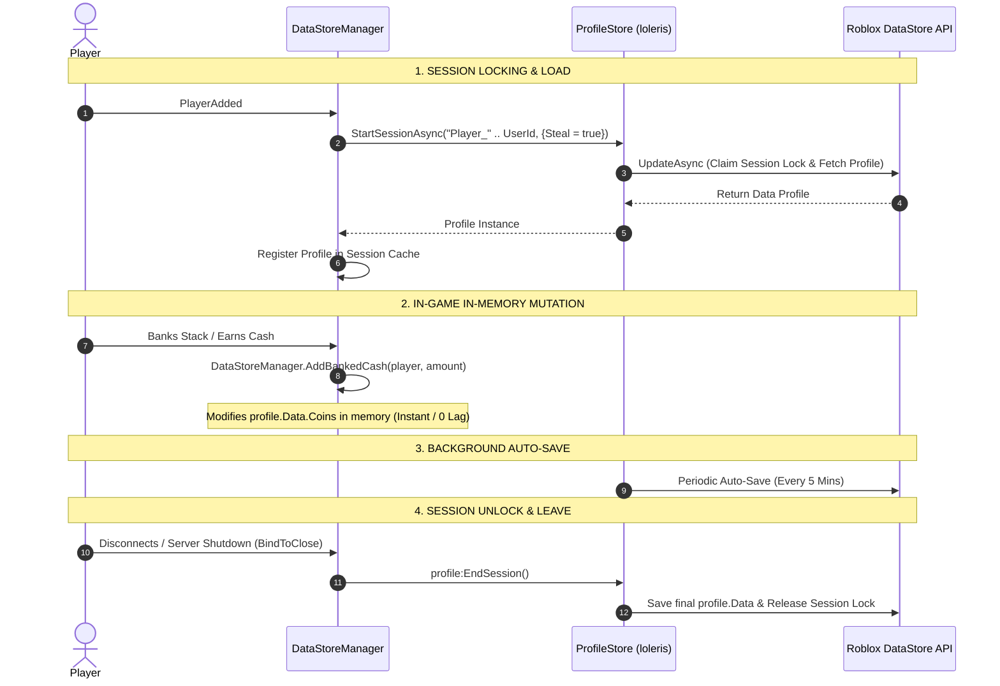

# 📄 SYSTEM 01: DATASTORE & GAME CONFIGURATION (ProfileStore)

This document specifies the data schema, configuration parameters, and server-side session management using **loleris's ProfileStore** for **Don't Drop The Coin!**.

---

## 🎯 OBJECTIVES
1. Provide a single source of truth for game constants (`src/shared/Config.luau`).
2. Manage player data persistence safely using **`ProfileStore`** (`src/server/DataManager/ProfileStore.luau`) with session locking, automatic schema reconciliation, pcall protection, auto-save timers, and `BindToClose` handling in `src/server/DataStoreManager.luau`.

---

## 📐 DATA SCHEMA (`Config.DEFAULT_DATA`)

```luau
{
    Coins = 0,             -- Permanent wallet cash banked
    TotalBanked = 0,       -- Lifetime total cash banked (for leaderboards)
    EquippedSkin = "Default",
    OwnedPasses = {},      -- Table of owned gamepass IDs
    LastSaved = 0          -- Unix timestamp of last successful save
}
```

---

## ⚙️ CONFIGURATION CONSTANTS (`Config.luau`)

| Category | Parameter | Value | Description |
| --- | --- | --- | --- |
| **Data** | `DATASTORE_KEY` | `"DontDropTheCoin_v1"` | Master ProfileStore DataStore key name |
| **Data** | `AUTO_SAVE_INTERVAL` | `300` (seconds) | Background auto-save frequency in ProfileStore |
| **Zones** | `ZONE_MULTIPLIERS` | `{Ground = 0, Zone1 = 1, Zone2 = 2, Zone3 = 3}` | Multipliers applied when banking coins |
| **Stack** | `MAX_RENDER_STACK` | `30` | Max physical coin parts welded to head |
| **Combat** | `BUMP_COOLDOWN` | `5` (seconds) | Cooldown duration for Dash Bump ability |
| **Combat** | `RAGDOLL_DURATION` | `2.5` (seconds) | Time player remains in ragdoll state when hit |
| **Group** | `GROUP_ID` | `0` *(Placeholder)* | Roblox Group ID for loyalty gate check |
| **Group** | `GROUP_MULTIPLIER` | `1.2` (+20%) | Permanent cash multiplier for group members |

---

## 🔁 PROFILESTORE SAVING LIFECYCLE



---

## 🛠️ DATASTORE MANAGER PUBLIC API

| Function | Parameters | Return | Description |
| --- | --- | --- | --- |
| `DataStoreManager.GetData(player)` | `player: Player` | `table?` | Returns active player `profile.Data` table |
| `DataStoreManager.AddBankedCash(player, amount)` | `player: Player`, `amount: number` | `boolean` | Adds permanent cash to wallet & total banked stats |
| `DataStoreManager.SaveAll()` | None | `void` | Releases all active sessions and saves profiles (used on shutdown) |
