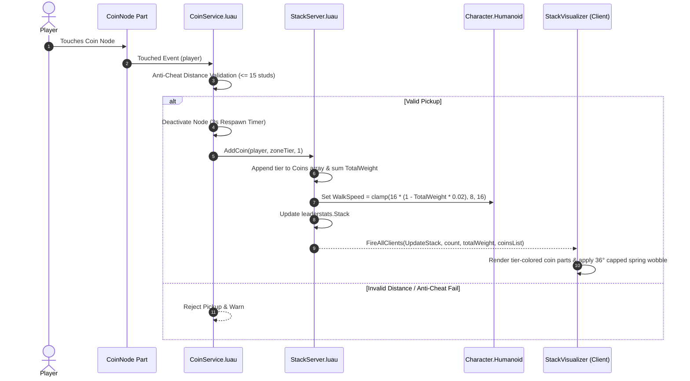

# 📄 SYSTEM 02: COIN SPAWNER & HEAD-STACKING ENGINE

This document specifies the server coin spawning architecture, distance-based anti-cheat validation, physical head-stack attachment, and client-side Lerp sway physics for **Don't Drop The Coin!**.

---

## 🎯 OBJECTIVES
1. Spawn floating collectible coin nodes across Zone 1 (1.0x) through Zone 10 (3.25x) using surface normal math and CollectionService tags.
2. Validate client coin pickups on the server with distance anti-cheat (max 15 studs).
3. Track per-coin zone tiers (`Coins: { number }`) and cumulative stack weight (`TotalWeight`) in `StackServer.luau`.
4. Apply dynamic humanoid movement encumbrance:
   $$\text{WalkSpeed} = \text{clamp}\big(\text{BaseSpeed} \times (1 - \text{TotalWeight} \times 0.02),\; 8,\; 16\big)$$
5. Render client-side visual coin stacks colored by tier with spring-based head sway clamped at $36^\circ$ to prevent horizontal tail distortion.
6. Preserve individual coin zone tiers and neon colors during ragdoll loot explosions.

---

## 📐 STACK DATA SCHEMA & ARCHITECTURE

```luau
type StackData = {
    Count: number,          -- Total count of coins currently stacked
    TotalWeight: number,    -- Cumulative weight based on Config.ZONE_TIERS[tier].Weight
    Coins: { number },      -- Ordered list of ZoneTier integers, e.g. {1, 1, 2, 5}
}
```



---

## ⚙️ COIN & STACK SPECIFICATION TABLE

| Component | Setting / Parameter | Description |
| --- | --- | --- |
| **Coin Node** | `RESPAWN_TIME` = 3s | Time before a collected coin node reappears in the arena |
| **Anti-Cheat** | `MAX_PICKUP_DIST` = 15 studs | Max distance allowed between player and coin for valid pickup |
| **Encumbrance** | `BASE_WALKSPEED` = 16 studs/s | Default unencumbered running speed |
| **Encumbrance** | `MIN_WALKSPEED` = 8 studs/s | Speed floor (50% max penalty) to protect obby platform clearance |
| **Encumbrance** | `WEIGHT_PENALTY_FACTOR` = 0.02 | Speed reduction per unit of total stack weight (25 weight = 50% penalty) |
| **Visual Stack** | `MAX_RENDER_STACK` = 30 parts | Hard visual rendering cap on head; excess coins tracked numerically |
| **Visual Stack** | `MAX_TILT` = 36 degrees (`math.rad(36)`) | Clamped angle cap to prevent horizontal tail artifact at high counts |
| **Visual Stack** | `STACK_OFFSET_Y` = 0.35 studs | Vertical distance between each stacked visual coin part |

---

## 🛠️ API & REMOTES CONTRACT

- **`StackServer.AddCoin(player, zoneTier?, count?) -> number`**:
  Adds coins of a specific zone tier, recalculates total weight, adjusts `Humanoid.WalkSpeed`, and replicates to clients.
- **`StackServer.ClearStack(player) -> (number, { number })`**:
  Clears the stack, restores `Humanoid.WalkSpeed = 16`, and returns previous count and coin tier array.
- **`StackServer.GetStackWeight(player) -> number`**:
  Returns current total weight of all coins on the player's head.
- **`StackServer.GetCoins(player) -> { number }`**:
  Returns an ordered clone of the coin tier array currently in the player's stack.
- **`Remotes.UpdateStack` (`RemoteEvent`)**:
  - `Server -> Client`: `UpdateStack:FireAllClients(player, count, totalWeight, coinsList)`
