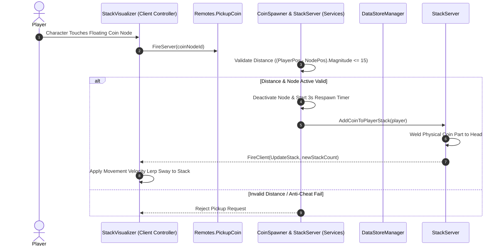

# 📄 SYSTEM 02: COIN SPAWNER & HEAD-STACKING ENGINE

This document specifies the server coin spawning architecture, distance-based anti-cheat validation, physical head-stack attachment, and client-side Lerp sway physics for **Don't Drop The Coin!**.

---

## 🎯 OBJECTIVES
1. Spawn floating collectible coin nodes across Zone 1 (1x), Zone 2 (2x), and Zone 3 (3x).
2. Validate client coin pickups on the server to prevent map-wide vacuum hacks.
3. Snap collected coin mesh models sequentially to the player's `Character.Head` socket.
4. Apply dynamic client-side rotational sway based on the character's movement velocity.

---

## 📐 ARCHITECTURE DIAGRAM

---

## ⚙️ COIN & STACK SPECIFICATION TABLE

| Component | Setting / Parameter | Description |
| --- | --- | --- |
| **Coin Node** | `RESPAWN_TIME` = 3s | Time before a collected coin node reappears |
| **Anti-Cheat** | `MAX_PICKUP_DIST` = 15 studs | Max distance allowed between player and coin for valid pickup |
| **Head Socket** | `AttachPoint` = `Character.Head` | Base attachment root for coin stack |
| **Height Step** | `STACK_OFFSET_Y` = 0.4 studs | Vertical distance between each stacked coin part |
| **Render Limit** | `MAX_RENDER_STACK` = 30 parts | Hard visual rendering cap on head; displays numerical text for count > 30 |

---

## 🛠️ API & REMOTES CONTRACT

- **`Remotes.PickupCoin` (`RemoteEvent`)**:
  - `Client -> Server`: `PickupCoin:FireServer(coinNodeId)`
- **`Remotes.UpdateStack` (`RemoteEvent`)**:
  - `Server -> Client`: `UpdateStack:FireClient(player, currentStackCount)`
