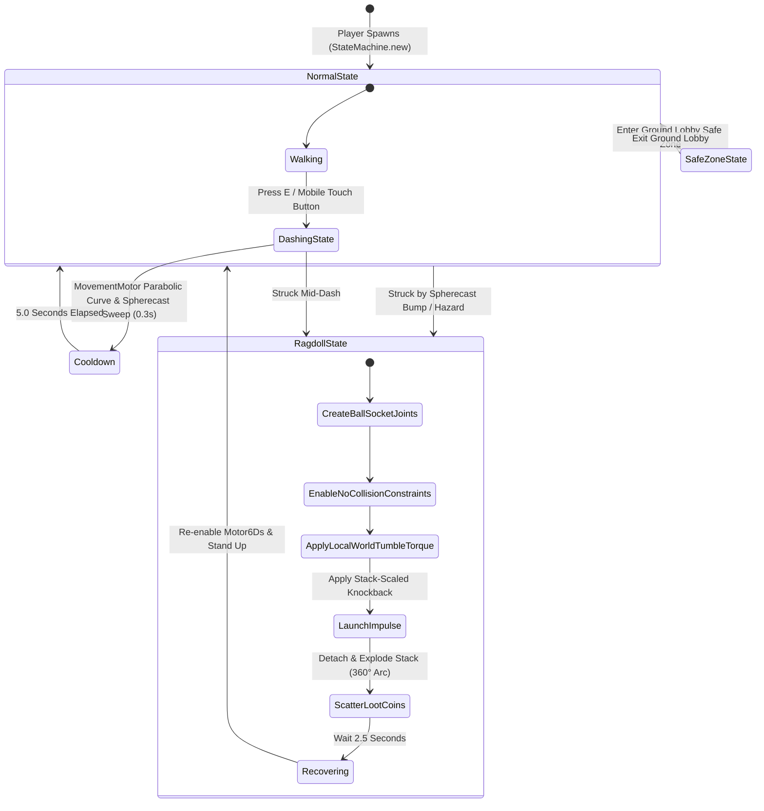

# 📄 SYSTEM 03: DASH BUMP COMBAT, RAGDOLL & LOOT EXPLOSION

This document specifies the OOP StateMachine architecture, MovementMotor integration, AnimationControllerV2 system, Workspace:Spherecast 3D swept hitboxes, BallSocketConstraint + NoCollisionConstraint physical limb ragdolls, Gizmo debug visualizers, Developer Debug GUI controls, and category-scoped Logger integration for **Don't Drop The Coin!**.

---

## 🎯 OBJECTIVES
1. Enforce strict OOP state management using class-based state definitions with lifecycle hooks (`canEnter`, `enter`, `exit`, `update`) adapted from the *Roblox AI Workspace* pattern (`StateMachine.luau`).
2. Maintain **persistent context tables** (`PlayerFSM.luau`) per player to guarantee state variables (`dashConnection`) are preserved across `enter()` and `exit()` hooks.
3. Integrate **`MovementMotor.luau`** (`src/shared/Utils/MovementMotor.luau`) for unified, leak-proof creation, steering capture (`AutoRotate`), and destruction of `LinearVelocity` physics constraints.
4. Integrate **`AnimationControllerV2`** (`src/client/Animation/`) for client-side preloading, sequence playback, and skill animation management (`Config.DASH_ANIMATION_ID`).
5. Program the **Dash Bump** ability (`E` key / Mobile touch button) using **`Workspace:Spherecast`** (4.5-stud 3D swept sphere along 15-stud forward path), smooth **parabolic velocity curve** ($6 \cdot t \cdot (1 - t)$ acceleration $\rightarrow$ deceleration), and `motor:destroy()` lifecycle cleanup.
6. Program a **2.5-Second Physics Ragdoll** state (`Humanoid.PlatformStand = true`, `Humanoid.EvaluateStateMachine = false`, dynamic `BallSocketConstraint` + `NoCollisionConstraint` physical limb sockets, `Enum.HumanoidStateType.Physics`, and local-to-world 3D pitch/roll tumbling torque).
7. Render 3D object-pooled debug gizmos (`DashBumpGizmoController.luau`) in Studio for trajectory lines, swept wire spheres, red impact hit markers, and golden hit labels.
8. Integrate **Category-Scoped Logger System** (`Logger.luau`) across `Input`, `Combat`, `FSM`, and `Ragdoll` modules.
9. Provide interactive **Developer Debug GUI** controls (`Combat Debug` panel) for live in-game testing of knockback, ragdoll, and full combat API simulations.

---

## 📐 OOP STATE MACHINE (FSM) ARCHITECTURE

---

## 📂 REGISTERED STATE CLASSES, COMBAT & GIZMOS

| Module File | Role / Purpose | Technical Implementation |
| --- | --- | --- |
| **`StateMachine.luau`** | Core OOP State Machine class | Manages lifecycle hooks (`canEnter`, `enter`, `exit`, `update`) |
| **`PlayerFSM.luau`** | Persistent context & FSM manager | Reuses `PlayerContexts[player]` & manages client hook execution |
| **`MovementMotor.luau`** | Reusable physics motor class | Handles `LinearVelocity`, steering capture, and `motor:destroy()` |
| **`Logger.luau`** | Category-scoped debug logging | Centralized logging (`Input`, `Combat`, `FSM`, `Ragdoll`) |
| **`CombatServer.luau`** | Server combat & hitbox service | Exposes `BumpVictim` API, `Spherecast` 3D hitboxes, and launch vectors |
| **`RagdollModule.luau`** | Physics ragdoll transition module | Replaces `Motor6Ds` with `BallSocketConstraint` & `NoCollisionConstraint` sockets |
| **`AnimationControllerV2.luau`** | Client animation engine | Handles track loading, preloading, and sequence crossfading |
| **`DashingState.luau`** | Dash Bump execution state | Uses `MovementMotor` parabolic velocity curve & animation playback |
| **`DashBumpGizmoController.luau`**| Client debug gizmo controller | Renders cyan sweep lines, red impact trajectory, and golden hit labels |
| **`DebugGuiController.luau`** | Developer Debug GUI controller | Renders `Combat Debug` panel with full API simulation buttons |

---

## ⚙️ COMBAT & PHYSICS SPECIFICATION TABLE

| Parameter | Value | Description |
| --- | --- | --- |
| **`BUMP_COOLDOWN`** | `5.0` seconds | Server-enforced cooldown between Dash Bump casts |
| **`DASH_DISTANCE`** | `15.0` studs | Exact forward distance character lunges during dash |
| **`DASH_DURATION`** | `0.3` seconds | Duration of forward dash movement |
| **`DASH_ANIMATION_ID`**| `"rbxassetid://102382549309160"` | Roblox Asset ID for custom Dash animation track |
| **`SPHERECAST_RADIUS`**| `4.5` studs | Radius of 3D swept sphere for collision detection |
| **`BASE_KNOCKBACK`** | `50` impulse | Base physical force applied to victim |
| **`STACK_KNOCKBACK_MULT`**| `2.0` per coin | Additional knockback force added per coin in victim's stack |
| **`RAGDOLL_DURATION`** | `2.5` seconds | Duration character remains in physical flopping ragdoll |
| **`LOOT_DESPAWN_TIME`** | `10.0` seconds | Lifetime of scattered physical coins before despawn pool recycling |
| **`MAX_DROPPED_COINS`** | `50` max | Hard server cap on active dropped coin parts to preserve performance |

---

## 🛠️ API & REMOTES CONTRACT

- **`CombatServer.BumpVictim(attackerPlayer, victimPlayer)`**: Server API to trigger complete combat bump pipeline (knockback, 360° stack explosion, 2.5s ragdoll, and client hit visualizers).
- **`Remotes.DashBump` (`RemoteEvent`)**: `Client -> Server`: `DashBump:FireServer()`
- **`Remotes.DashBumpHit` (`RemoteEvent`)**: `Server -> Client`: `DashBumpHit:FireAllClients(attacker, victimName, hitPos, force)`
- **`Remotes.TriggerRagdoll` (`RemoteEvent`)**: `Server -> Client`: `TriggerRagdoll:FireClient(victimPlayer, duration, launchVector)`
- **`Remotes.SimulateDashBump` (`RemoteEvent`)**: `Client -> Server`: Debug simulation trigger for `BumpVictim(nil, player)`.

---

## 🛠️ POLISH & FUTURE BACKLOG

The following items are identified for future combat & physics polish passes:

1. **Residual Knockback Force Dampening:**
   * *Issue:* Residual velocity forces occasionally apply a secondary push to ragdolled characters after the initial knockback launch.
   * *Target Fix:* Implement frame-delayed velocity dampening (`AssemblyLinearVelocity` damping / clamping) on the second physics tick following impact.

2. **Ragdoll Recovery Duration Tuning:**
   * *Issue:* The current 2.5-second ragdoll duration feels slightly long during fast-paced arena movement.
   * *Target Fix:* Tune `Config.RAGDOLL_DURATION` down to 1.5s - 2.0s or introduce stack-scaled recovery timing (higher stacks = longer recovery).

3. **Get-Up Recovery Animation & Blending:**
   * *Issue:* Transitioning from ragdoll back to standing uses standard Roblox `GettingUp` state logic.
   * *Target Fix:* Integrate custom "Get-Up" recovery animation tracks via `AnimationControllerV2` with smooth crossfading into `NormalState`.
