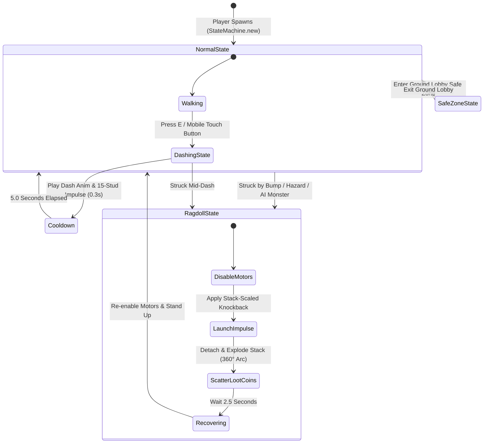

# 📄 SYSTEM 03: DASH BUMP COMBAT, RAGDOLL & LOOT EXPLOSION

This document specifies the OOP StateMachine architecture, AnimationControllerV2 integration, Dash Bump combat ability mechanics, 2.5-second physics ragdoll transitions, and unanchored loot explosion scattering for **Don't Drop The Coin!**.

---

## 🎯 OBJECTIVES
1. Enforce strict OOP state management using class-based state definitions with lifecycle hooks (`canEnter`, `enter`, `exit`, `update`) adapted from the *Roblox AI Workspace* pattern (`StateMachine.luau`).
2. Integrate **`AnimationControllerV2`** (`src/client/Animation/`) for client-side preloading, sequence playback, and skill animation management (`Config.DASH_ANIMATION_ID`).
3. Program the **Dash Bump** ability (`E` key / Mobile touch button) with a 15-stud forward distance burst (`DASH_DISTANCE`), 5-second server-verified cooldown, and stack-scaled knockback impulse.
4. Program a **2.5-Second Physics Ragdoll** state (`Humanoid.PlatformStand = true`, `Motor6D` socket constraints).
5. Program the **Loot Explosion Engine**: Detach head stack, scatter glowing unanchored physical coin parts in a 360° radial arc, and enable 10-second vacuum pickups.

---

## 📐 OOP STATE MACHINE (FSM) ARCHITECTURE

---

## 📂 REGISTERED STATE CLASSES & ANIMATION ENGINE

| Module File | Role / Purpose | Animation & Action Handling |
| --- | --- | --- |
| **`StateMachine.luau`** | Core OOP State Machine class | Manages lifecycle hooks (`canEnter`, `enter`, `exit`, `update`) |
| **`AnimationControllerV2.luau`** | Client animation engine | Handles track loading, preloading, and sequence crossfading |
| **`DashingState.luau`** | Dash Bump execution state | Plays `Config.DASH_ANIMATION_ID` track on `Humanoid.Animator` |
| **`RagdollState.luau`** | Physics ragdoll state | Disables `Motor6D` joints (2.5s) & re-enables on exit |

---

## ⚙️ COMBAT & PHYSICS SPECIFICATION TABLE

| Parameter | Value | Description |
| --- | --- | --- |
| **`BUMP_COOLDOWN`** | `5.0` seconds | Server-enforced cooldown between Dash Bump casts |
| **`DASH_DISTANCE`** | `15.0` studs | Exact forward distance character lunges during dash |
| **`DASH_DURATION`** | `0.3` seconds | Duration of forward dash movement |
| **`DASH_ANIMATION_ID`**| `"rbxassetid://102382549309160"` | Roblox Asset ID for custom Dash animation track |
| **`BASE_KNOCKBACK`** | `50` impulse | Base physical force applied to victim |
| **`STACK_KNOCKBACK_MULT`**| `2.0` per coin | Additional knockback force added per coin in victim's stack |
| **`RAGDOLL_DURATION`** | `2.5` seconds | Duration character remains in unanchored physics ragdoll |
| **`LOOT_DESPAWN_TIME`** | `10.0` seconds | Lifetime of scattered physical coins before despawn pool recycling |
| **`MAX_DROPPED_COINS`** | `50` max | Hard server cap on active dropped coin parts to preserve performance |

---

## 🛠️ API & REMOTES CONTRACT

- **`Remotes.DashBump` (`RemoteEvent`)**:
  - `Client -> Server`: `DashBump:FireServer()`
- **`Remotes.TriggerRagdoll` (`RemoteEvent`)**:
  - `Server -> Client`: `TriggerRagdoll:FireClient(victimPlayer, duration)`
