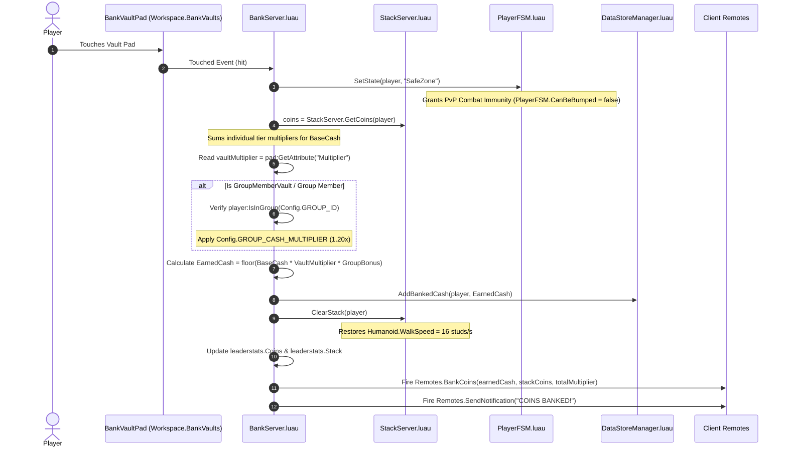

# 📄 SYSTEM 04: SAFE ZONE BANKING VAULTS & ZONE MULTIPLIERS

This document specifies the multi-vault architecture, zone multiplier math, Roblox Group loyalty gate validation, `leaderstats` stats tracking, and Safe Zone combat immunity for **Don't Drop The Coin!**.

---

## 🎯 OBJECTIVES
1. Manage multi-vault cashout pads across different map tiers (`Workspace.BankVaults`) via **`BankServer.luau`**.
2. Dynamically calculate cashouts factoring in each individual coin's tier multiplier from `Config.ZONE_TIERS`, combined with vault pad multipliers and group loyalty bonuses:
   $$\text{BaseCash} = \sum_{i=1}^{\#\text{coins}} \text{Multiplier}(\text{tier}_i)$$
   $$\text{Earned Cash} = \max\Big(1,\; \left\lfloor \text{BaseCash} \times \text{VaultMultiplier} \times \text{GroupBonus} \right\rfloor\Big)$$
3. Validate Roblox Group membership (`player:IsInGroup(Config.GROUP_ID)`) for group-exclusive vaults (`GroupMemberVault`) and apply `Config.GROUP_CASH_MULTIPLIER` (+20%).
4. Reset the player's head stack and immediately restore their `Humanoid.WalkSpeed` back to `16 studs/s`.
5. Update `leaderstats` (`Coins` & `Stack` IntValues) on cashout and persist banked cash via ProfileStore (`DataStoreManager.AddBankedCash`).
6. Enforce **Safe Zone Combat Immunity** (`SafeZone` FSM State) while players stand on any vault pad to prevent PvP griefing during cashouts.

---

## 📐 MULTI-VAULT MAP SPECIFICATION (`Workspace.BankVaults`)

| Vault Name | Location | Color | Multiplier | Loyalty Gate | Description |
| --- | --- | --- | --- | --- | --- |
| **`LobbyVault`** | `(0, 0.5, -45)` | Neon Green | **`1.0x`** | Open | Standard Ground Floor Lobby Bank Vault |
| **`GroupMemberVault`** | `(-30, 0.5, -45)` | Neon Gold | **`1.2x`** | `GROUP_ID` | Group Loyalty Gate (+20% cash bonus) |
| **`Zone2ChaosVault`** | `(0, 60, -45)` | Neon Cyan | **`2.0x`** | Open | Zone 2 Mid-Tier Sky Vault |
| **`Zone3VoidVault`** | `(0, 150, -45)` | Neon Magenta | **`3.0x`** | Open | Zone 3 High-Stakes Void Sky Vault |

---

## ⚙️ CASHOUT & IMMUNITY FLOW

---

## 🛠️ API CONTRACT & UI SYNC

- **`BankServer.BankStackAtVault(player: Player, vaultPad: BasePart?): boolean`**: Server API to cash out a player's stack at a specific vault pad with compound tier multipliers, vault multipliers, and group loyalty bonuses.
- **`BankServer.BankStack(player: Player): boolean`**: Convenience API to cash out stack at default 1.0x vault multiplier.
- **`BankServer.UpdateLeaderstats(player: Player)`**: Updates `leaderstats.Coins` and `leaderstats.Stack` IntValues on player list.
- **`HUDController.luau`**: Client controller listening to `leaderstats.Stack.Changed` and `leaderstats.Coins.Changed` to update `WalletFrame.CoinsLabel` (`COINS: X`) and `WalletFrame.BankedLabel` (`BANKED: $X`) in real-time.
- **`Remotes.BankCoins` (`RemoteEvent`)**: `Server -> Client`: `BankCoins:FireClient(player, earnedCash, stackCoins, totalMultiplier)`
