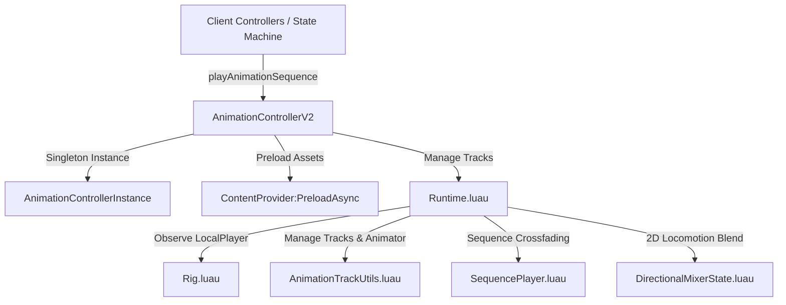

# 📄 ANIMATION ENGINE ARCHITECTURE (`AnimationControllerV2`)

This document specifies the architecture, sequence players, 2D directional mixers, asset preloader, and character rig observation engine adapted from *Roblox AI Workspace* for **Don't Drop The Coin!**.

---

## 🎯 OBJECTIVES
1. Provide a client-side animation engine (`AnimationControllerV2.luau`) capable of instant playback with zero network delay.
2. Enable preloading of animation assets into `ContentProvider` to eliminate visual pop-in lag.
3. Manage multi-clip sequence playback with smooth crossfading (`SequencePlayer.luau`).
4. Support 2D directional locomotion weight blending (`DirectionalMixerState.luau`) for character movement.

---

## 📐 ANIMATION ENGINE ARCHITECTURE DIAGRAM



---

## 📂 MODULE FILE MAP (`src/client/Animation/`)

| Module File | Class / Responsibility | API Methods / Key Functions |
| --- | --- | --- |
| **`AnimationControllerV2.luau`** | Main client animation API controller | `playAnimationSequence()`, `preloadAnimationIds()`, `stopAnimationSequence()` |
| **`AnimationControllerInstance.luau`**| Client-wide singleton instance | `require(script.Parent.AnimationControllerV2).new()` |
| **`Runtime.luau`** | Low-level track & lane manager | `ensureIdTrack()`, `play()`, `stopOwner()`, `disableDefaultAnimate()` |
| **`SequencePlayer.luau`** | Multi-clip sequence & crossfade player | `play()`, `update()`, `stop()`, `isComplete()` |
| **`DirectionalMixerState.luau`** | 2D directional weight blending | `setInput(Vector2)`, `getInput()`, `stop()` |
| **`AnimationTrackUtils.luau`** | Animator loading & track utility | `getAnimator()`, `createConfiguredTrack()`, `stopTrackSet()` |
| **`AnimationSequenceUtils.luau`** | Sequence config parsing helper | `getSequence()`, `getClipConfig()`, `ensureConfiguredSequenceTracks()` |
| **`Transitions.luau`** | Immutable transition constructors | `Transitions.track()`, `Transitions.blend()`, `Transitions.sequenceClip()` |
| **`AnimationTypes.luau`** | Luau type definitions | `TrackSet`, `AnimationSequence`, `DirectionalMixerStateHandle` |
| **`Rig.luau`** (`src/client/Rig.luau`) | LocalPlayer character & humanoid observer | `Rig.start()`, `Rig.observe()`, `Rig.getState()` |

---

## ⚙️ USAGE EXAMPLES

### 1. Playing a Skill Animation Sequence (e.g., Dash Bump)
```luau
local AnimationControllerInstance = require(game:GetService("StarterPlayer").StarterPlayerScripts.Client.Animation.AnimationControllerInstance)

-- Play Dash Bump animation sequence
AnimationControllerInstance:playAnimationSequence({
    Config.DASH_ANIMATION_ID
}, {
    priority = Enum.AnimationPriority.Action,
    entryFadeTime = 0.05,
})
```

### 2. Preloading Animation Asset IDs
```luau
AnimationControllerInstance:preloadAnimationIds({
    Config.DASH_ANIMATION_ID,
    "rbxassetid://123456789",
})
```
