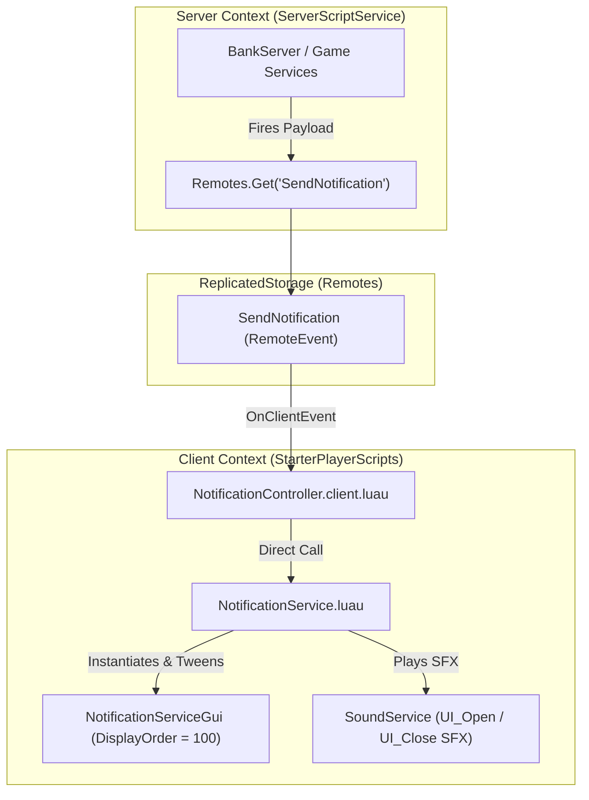

# 🔔 NOTIFICATION SYSTEM ARCHITECTURE & DOCUMENTATION

This document details the design, API specification, network communication protocol, and UI animation pipelines of the **Notification System** in **Don't Drop The Coin!**.

---

## 🏗️ 1. ARCHITECTURE OVERVIEW

The notification system provides a high-priority, animated visual feedback overlay for critical gameplay events (such as banking coins, unlocking achievements, or displaying warnings).



---

## 📜 2. MODULE API SPECIFICATION

### Location: [`src/shared/UI/NotificationService.luau`](file:///Users/ridhomfadlan/Documents/Roblox%20Files/dont-drop-the-coin/src/shared/UI/NotificationService.luau)

The `NotificationService` module is a singleton utility available under `ReplicatedStorage.Shared.UI.NotificationService`.

### Types

```luau
export type BannerConfig = {
    Title: string?,       -- Banner header text (Default: "ANNOUNCEMENT")
    Description: string?, -- Subtext body (Default: "")
    Duration: number?,    -- Visibility duration in seconds (Default: 5)
    Color: Color3?,       -- Accent color for title & border UIStroke (Default: Gold #FFD700)
    SoundName: string?,   -- Sound asset name under ReplicatedStorage.Sounds.GuisSounds (Default: "Open_UI")
}
```

---

### Functions

#### `NotificationService.showBanner(config: BannerConfig): ()`
Displays an animated banner notification at the top-center of the local player's screen.

* **Screen Container**: Automatically mounts a `ScreenGui` named `NotificationServiceGui` inside `PlayerGui` with `DisplayOrder = 100` and `ResetOnSpawn = false`.
* **Template Resolution**: Searches for a template named `BannerTemplate` in `PlayerGui.NotificationGui`, `PlayerGui.NotificationServiceGui`, or `ReplicatedStorage`. If no template is found in the workspace, it builds a standard dark glassmorphism fallback frame dynamically.
* **Tween Animations**:
  * **Entrance**: Scales up from `0` to `1` using `Enum.EasingStyle.Back` and `Enum.EasingDirection.Out` over `0.35s`.
  * **Exit**: Scales down from `1` to `0` using `Enum.EasingStyle.Back` and `Enum.EasingDirection.In` over `0.25s`, destroying the banner instance upon completion.
* **Thread Safety**: Cleans up existing banner instances and cancels running exit threads if a new notification is triggered while a banner is already active.

#### `NotificationService.showToast(message: string, messageType: string?, duration: number?): ()`
Displays a quick non-intrusive text toast.
* Uses `Tabs.Notify` if present under `PlayerGui.Tabs`.
* Falls back to Roblox's native `StarterGui:SetCore("SendNotification", ...)` if custom UI elements are absent.

---

## 📡 3. NETWORK CONTRACT

### Remote Event: `SendNotification`
* **Path**: `ReplicatedStorage.Remotes.SendNotification`
* **Direction**: Server $\rightarrow$ Client

### Payload Signatures

The client controller [`NotificationController.client.luau`](file:///Users/ridhomfadlan/Documents/Roblox%20Files/dont-drop-the-coin/src/client/Controllers/NotificationController.client.luau) accepts two payload variations:

1. **Table Payload (Recommended)**:
   ```luau
   SendNotification:FireClient(player, {
       Title = "💰 COINS BANKED!",
       Description = "Banked 10 coins for $20 cash!",
       Duration = 3.5,
       Color = Color3.fromRGB(0, 230, 120),
       SoundName = "Open_UI",
   })
   ```

2. **Positional Arguments**:
   ```luau
   SendNotification:FireClient(player, "LEVEL UP!", "You reached Level 5!", 4)
   ```

---

## 💻 4. USAGE EXAMPLES

### Server-Side Trigger (Single Player)
```luau
local ReplicatedStorage = game:GetService("ReplicatedStorage")
local Remotes = require(ReplicatedStorage.Shared.Remotes)

local sendNotif = Remotes.Get("SendNotification")
if sendNotif then
    sendNotif:FireClient(player, {
        Title = "💰 COINS BANKED!",
        Description = "Banked 5 coins at Vault Multiplier 2x!",
        Duration = 3.5,
        Color = Color3.fromRGB(0, 230, 120),
    })
end
```

### Server-Side Broadcast (All Players)
```luau
local sendNotif = Remotes.Get("SendNotification")
if sendNotif then
    sendNotif:FireAllClients({
        Title = "⚡ DOUBLE CASH EVENT!",
        Description = "All coin banking payouts are doubled for the next 5 minutes!",
        Duration = 7,
        Color = Color3.fromRGB(255, 170, 0),
    })
end
```

### Client-Side Direct Call
```luau
local ReplicatedStorage = game:GetService("ReplicatedStorage")
local NotificationService = require(ReplicatedStorage.Shared.UI.NotificationService)

NotificationService.showBanner({
    Title = "⚠️ CANNOT DASH!",
    Description = "Dash ability is on cooldown.",
    Duration = 2,
    Color = Color3.fromRGB(255, 60, 60),
})
```
