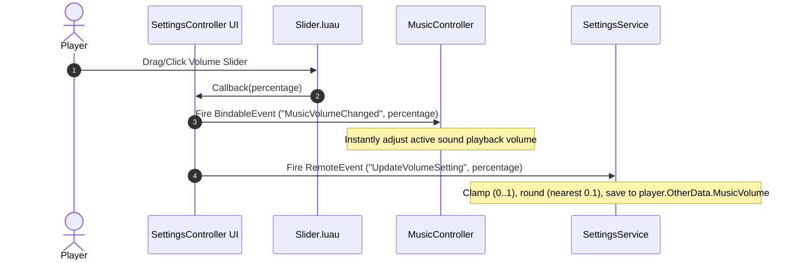

# Settings & TopbarPlus System Technical Documentation

The **Settings & TopbarPlus System** manages user preferences (such as audio volume), interface toggles via topbar buttons, and persistent setting storage across game sessions in `dont-drop-the-coin`.

---

## 1. System Architecture Overview

```
src/
├── shared/
│   ├── TopbarPlus/                # TopbarPlus v2.0+ framework (Icon, Themes, Overflow)
│   ├── UI/
│   │   ├── Slider.luau            # Drag/click slider component with step snapping
│   │   ├── OpenFrame.luau         # Menu visibility, blur effects & fade transitions
│   │   └── ButtonFunctionality.luau# Hover/click SFX & scale feedback
│   └── Config/
│       └── SoundConfig.luau       # Default volume values & playlist asset IDs
├── client/
│   └── Controllers/
│       ├── SettingsController.client.luau # Topbar icon, frame builder, slider bindings
│       └── MusicController.client.luau    # Dynamic volume adjustment listener
└── server/
    └── Services/
        └── SettingsService.luau   # Server remote event validation & data persistence
```

---

## 2. TopbarPlus Integration

The TopbarPlus framework is mapped in `ReplicatedStorage.Shared.TopbarPlus` and exposes the `Icon` class for creating custom topbar buttons.

### Creating the Settings Topbar Button
In [`src/client/Controllers/SettingsController.client.luau`](../../src/client/Controllers/SettingsController.client.luau):

```luau
local ReplicatedStorage = game:GetService("ReplicatedStorage")
local SharedFolder = ReplicatedStorage:WaitForChild("Shared")
local Icon = require(SharedFolder:WaitForChild("TopbarPlus"):WaitForChild("Icon"))

local settingsIcon = Icon.new()
	:setName("SettingsButton")
	:setImage("rbxassetid://18209577633")
	:setCaption("Settings")
```

### Event Binding & State Synchronization
Topbar button selection state is synchronized with `OpenFrame.ToggleFrame("SettingsFrame")` using recursion flags:

```luau
local isToggling = false

-- Open frame on topbar icon click
settingsIcon.selected:Connect(function()
	if isToggling then return end
	isToggling = true
	if not settingsFrame.Visible then
		OpenFrame.ToggleFrame("SettingsFrame")
	end
	isToggling = false
end)

-- Close frame on topbar icon deselect
settingsIcon.deselected:Connect(function()
	if isToggling then return end
	isToggling = true
	if settingsFrame.Visible then
		OpenFrame.ToggleFrame("SettingsFrame")
	end
	isToggling = false
end)

-- Deselect topbar icon if frame becomes hidden (e.g. via Close button)
settingsFrame:GetPropertyChangedSignal("Visible"):Connect(function()
	if not settingsFrame.Visible and settingsIcon.isSelected then
		isToggling = true
		settingsIcon:deselect()
		isToggling = false
	end
end)
```

---

## 3. UI Slider Component (`Slider.luau`)

Located at [`src/shared/UI/Slider.luau`](../../src/shared/UI/Slider.luau) (replicated as `ReplicatedStorage.Shared.UI.Slider`).

### API Constructor
```luau
Slider.new(sliderFrame: Frame, knob: GuiButton, callback: (value: number) -> (), step: number?): SliderInstance
```
- **`sliderFrame`**: Container track frame.
- **`knob`**: Draggable knob button.
- **`callback`**: Function invoked on percentage change ($0.0 - 1.0$).
- **`step`**: Optional step snapping increment (e.g., `0.1` for 10% steps).

### Usage Example
```luau
local Slider = require(ReplicatedStorage.Shared.UI.Slider)

local sliderInstance = Slider.new(musicSliderFrame, knobButton, function(value)
	print("Slider value changed:", value)
end, 0.1)

sliderInstance:SetValue(0.5) -- Set initial position to 50%
```

---

## 4. Networking & Data Flow



### Remotes & Bindable Events

| Event Name | Type | Direction | Payload | Description |
| --- | --- | --- | --- | --- |
| `MusicVolumeChanged` | `BindableEvent` | Client $\rightarrow$ Client | `value: number` | Immediate local notification for client music/audio controllers. |
| `UpdateVolumeSetting` | `RemoteEvent` | Client $\rightarrow$ Server | `value: number` | Server RPC to validate and persist user setting values. |

---

## 5. Server Persistence (`SettingsService.luau`)

Located at [`src/server/Services/SettingsService.luau`](../../src/server/Services/SettingsService.luau) (synced to `ServerScriptService.Server.Services.SettingsService`).

- Validates incoming settings payload.
- Ensures `Player.OtherData.MusicVolume` exists.
- Updates setting values for session DataStore auto-saving.
