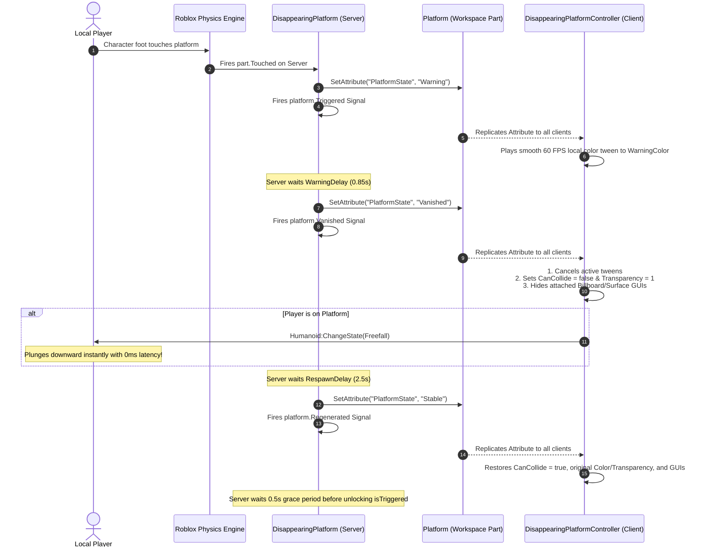

# 📄 SYSTEM 11: DISAPPEARING PLATFORMS (DETERMINISTIC CLIENT-SIDE COLLISION)

This document specifies the architecture, networking, client-side collision mechanics, and designer configuration for **Zone 3 Disappearing Platforms** in **Don't Drop The Coin!**.

---

## 🎯 OBJECTIVES
1. Provide responsive, fair, and high-stakes floor hazard steps for Zone 3 (*The Void Lunatic*).
2. Completely eliminate common Roblox Humanoid platform physics bugs (floating characters, physics fling on respawn, and tween property overwrites).
3. Utilize a **Deterministic Client-Side Collision** model: server authoritative state machine replicated via Attributes, with 0ms client-side collision drops and instant `Freefall` state enforcement.
4. Expose decoupled lifecycle signals via **`SignalModule`** (`Triggered`, `Vanished`, `Regenerated`).

---

## 🏗️ DIRECTORY ARCHITECTURE

```
src/
├── shared/
│   └── Config/
│       └── init.luau                          <-- Global hazard timings & default colors
│
├── server/
│   ├── Hazards/
│   │   └── DisappearingPlatform.luau          <-- Server OOP state machine & debounce
│   └── Services/
│       └── DisappearingPlatformService.luau   <-- Workspace folder & CollectionService tag binder
│
└── client/
    └── Controllers/
        └── DisappearingPlatformController.luau<-- Local tweens, 0ms CanCollide = false, Freefall trigger
```

---

## 🔄 LIFECYCLE & STATE MACHINE



---

## ⚙️ CONFIGURATION & DESIGNER ATTRIBUTES

### 1. Global Defaults (`src/shared/Config/init.luau`)
Configured centrally under `Config.HAZARDS.DISAPPEARING_PLATFORM`:
```lua
Config.HAZARDS = {
    DISAPPEARING_PLATFORM = {
        WARNING_DELAY = 0.85,                          -- Seconds flashing red before vanishing
        RESPAWN_DELAY = 2.5,                           -- Seconds invisible and non-collidable
        WARNING_COLOR = Color3.fromRGB(255, 60, 60),  -- Warning flash color
    },
}
```

### 2. Per-Instance Studio Overrides
Designers can override defaults on any individual Part or Model in Roblox Studio via **Attributes**:

| Attribute | Type | Default | Description |
| :--- | :---: | :---: | :--- |
| **`WarningDelay`** | `number` | `0.85` | Duration of the warning color flash before collision drops. |
| **`RespawnDelay`** | `number` | `2.5` | Duration the platform remains vanished before regenerating. |
| **`WarningColor`** | `Color3` | `(255, 60, 60)` | Color applied during the warning lerp. |

---

## 🛠️ LEVEL DESIGNER WORKFLOW (SUBFOLDERS & TAGS)

Designers have two flexible ways to create disappearing platforms in Studio:

### Option A: Folder Organization (Recommended)
Place any Part or Model inside:
```
Workspace/
└── Hazards/
    └── DisappearingPlatforms/
        ├── Platform1 (Part)
        └── CustomBridge (Model with multiple Parts)
```
* Single `BasePart`: Handled directly.
* `Model`: `DisappearingPlatform` automatically detects all `BasePart` descendants inside the model and synchronizes them together.

### Option B: CollectionService Tag
Add the tag **`Hazard_DisappearingPlatform`** to any Part or Model anywhere in `Workspace`. `DisappearingPlatformService` will auto-bind it at runtime.

---

## 🛡️ ENGINE EDGE CASES SOLVED

| Edge Case | Root Cause in Engine | Architectural Fix |
| :--- | :--- | :--- |
| **Floating Character** | Humanoid raycasts for floor support and fails to register server `CanCollide = false` in time. | **Deterministic Client Drop:** Client executes `CanCollide = false` locally and immediately calls `Humanoid:ChangeState(Enum.HumanoidStateType.Freefall)`. |
| **Stuck in Red** | Server `task.wait()` and `TweenService` clock drift causes late tween frames to overwrite `Transparency = 1`. | **Client-Side Tweens & Explicit Cancellation:** Client tracks `activeTween` and calls `:Cancel()` immediately before applying state changes. |
| **Instant Re-Trigger** | Standing on the platform when it regenerates fires `.Touched` within 1 frame. | **Post-Regeneration Debounce:** Server enforces a `0.5s` cooldown after regeneration before resetting `isTriggered = false`. |
| **Lingering Floating Text** | Attached `BillboardGui`s remain visible when parts turn invisible. | **GUI Synchronization:** Client toggles `gui.Enabled` on all attached billboard and surface GUIs matching the platform state. |
