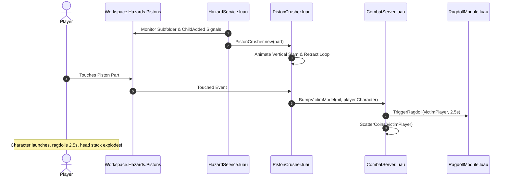

# 📄 SYSTEM 11: MODULAR ENVIRONMENTAL HAZARDS (ZONE 2 & ZONE 3)

This document specifies the subfolder-driven architecture, modular OOP hazard classes, `Workspace.Hazards` organization, and collision knockback integration for **Don't Drop The Coin!**.

---

## 🎯 OBJECTIVES
1. Provide a zero-tag, designer-friendly folder structure in `Workspace.Hazards` for Zone 2 & Zone 3 environmental hazards.
2. Maintain standalone modular OOP classes under `src/server/Hazards/` (`PistonCrusher`, `PendulumObstacle`, `DisappearingPlatform`, `GlitchDroneAI`).
3. Connect physical obstacle impacts (`Pistons`, `Pendulums`, `Drones`) directly to `CombatServer.BumpVictimModel()`, launching struck players into a **2.5s physical ragdoll** and exploding their head stack.
4. Provide interactive disappearing platforms (`DisappearingPlatforms`) that warn players via color flashing before dropping collision and regenerating.

---

## 📂 SUBFOLDER HIERARCHY (`Workspace.Hazards`)

Level designers organize obstacles by placing Parts or Models directly into designated subfolders under `Workspace.Hazards`:

```
Workspace/
└── Hazards/
    ├── Pistons/                 <-- Any Part inside becomes a Piston Crusher
    ├── Pendulums/               <-- Any Part inside becomes a Swinging Pendulum
    ├── DisappearingPlatforms/   <-- Any Part inside becomes a Disappearing Platform
    └── Drones/                  <-- Any Model inside becomes a Glitch Drone AI
```

---

## ⚙️ HAZARD BEHAVIOR MATRIX

| Hazard Class | Target Subfolder | Animation / Movement | Impact Behavior |
| --- | --- | --- | --- |
| **`PistonCrusher`** | `Workspace.Hazards.Pistons` | Fast vertical slam down (0.25s), pause (0.3s), smooth retract (1.2s). | Calls `CombatServer.BumpVictimModel()` $\rightarrow$ 2.5s ragdoll + stack explosion. |
| **`PendulumObstacle`** | `Workspace.Hazards.Pendulums` | Continuous sine-wave angular rotation back and forth across walkways. | Calls `CombatServer.BumpVictimModel()` $\rightarrow$ 2.5s ragdoll + stack explosion. |
| **`DisappearingPlatform`** | `Workspace.Hazards.DisappearingPlatforms` | Flashes red warning (1.0s) on step, sets `CanCollide = false` (2.0s), then regenerates. | Character falls through platform into lower tiers or void. |
| **`GlitchDroneAI`** | `Workspace.Hazards.Drones` | Patrols Zone 3 sky platforms ($Y \ge 120$), chases nearest player within 40 studs at 14 studs/sec. | Calls `CombatServer.BumpVictimModel()` on contact $\rightarrow$ 2.5s ragdoll + stack explosion. |

---

## 🏗️ ARCHITECTURE FLOW



---

## 🛠️ API & CLASS CONTRACTS

- **`HazardService.Init()`**: Scans and binds all subfolders (`Pistons`, `Pendulums`, `DisappearingPlatforms`, `Drones`) under `Workspace.Hazards`.
- **`PistonCrusher.new(part, dropDistance?, cycleTime?)`**: Instantiates a vertical piston crusher component.
- **`PendulumObstacle.new(part, swingAngle?, swingSpeed?)`**: Instantiates a swinging pendulum component.
- **`DisappearingPlatform.new(part, warningDelay?, respawnDelay?)`**: Instantiates a disappearing platform component.
- **`GlitchDroneAI.new(model, detectionRadius?, moveSpeed?)`**: Instantiates a Zone 3 AI drone hunter component.
