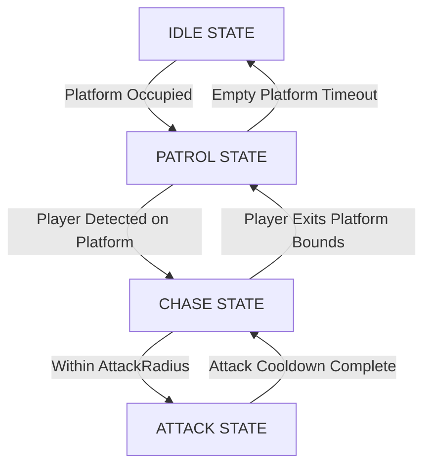

# System Specification 12: Universal Guard AI Engine

**Status:** IMPLEMENTED  
**Location:** `Packages/GuardAIModule` & `src/server/Services/GuardAIService.luau`  

---

## 1. Overview

The **Universal Guard AI Engine** powers automated NPC enemy and hazard guard behaviors across Tower Zone floors and hazard platforms. Every AI model in the game uses standard Roblox **`Humanoid`** character navigation (`Humanoid:MoveTo()`), driven by a modular finite state machine (`StateMachineModule`).

Guards are integrated into the tower through an event-driven pub/sub model by subscribing to **`ZoneService.OnZoneFloorDiscovered`**, which automatically binds waypoints, leashes movement to arena floor slabs, and drives rig-specific animations.

---

## 2. Architecture & Directory Layout

```
Packages/
└── GuardAIModule/                      <-- [Standalone OOP Guard Engine]
    ├── init.luau                       <-- [Constructor, Context Setup, Leash Geometry]
    ├── Types.luau                      <-- [Exported Type Definitions]
    └── States/
        ├── IdleState.luau              <-- [Dormant / Standby State]
        ├── PatrolState.luau            <-- [Waypoint Patrol Loop State]
        ├── ChaseState.luau             <-- [Target Pursuit State]
        ├── AttackState.luau            <-- [Strike & Ragdoll Bump State]
        ├── CombatState.luau            <-- [Duel Stance with Companions]
        ├── KnockedOutState.luau        <-- [Stun / Ragdoll Recovery State]
        ├── ReturnState.luau            <-- [Return to Leash Origin]
        └── RetrieveState.luau          <-- [Item Fetch State]

src/
├── server/
│   └── Services/
│       ├── GuardAIService.luau         <-- [Server Orchestrator & Zone Subscriber]
│       └── ZoneService.luau            <-- [Master Floor Slab Discovery Publisher]
│
└── shared/
    └── Config/
        └── init.luau                   <-- [GUARD_TEMPLATES & ZONE_GUARDS Config]
```

---

## 3. FSM State Lifecycle



### State Specifications

| State Name | Trigger | Movement / Action | Exit Condition |
| :--- | :--- | :--- | :--- |
| **`IdleState`** | Server init or dormant floor. | Halts movement (`humanoid:MoveTo(currentPos)`). Hides healthbars. | Target enters platform $\rightarrow$ `PatrolState` / `ChaseState`. |
| **`PatrolState`** | Default floor activity. | Loops sequentially through `Waypoints` using `humanoid:MoveTo(wpPos)`. Speed = `moveSpeed`. | Player detected on platform within `detectionRadius` $\rightarrow$ `ChaseState`. |
| **`ChaseState`** | Target player detected. | Pursues player HRP via `humanoid:MoveTo(targetPos)`. Speed = `moveSpeed + 2`. | Distance $\le \text{AttackRadius} \rightarrow$ `AttackState`. Target leaves platform $\rightarrow$ `PatrolState`. |
| **`AttackState`** | Within attack distance. | Plays optional attack track, calls `CombatServer.BumpVictimModel()`. | Attack delay finishes $\rightarrow$ `ChaseState`. |

---

## 4. Platform Spatial Footprint Boundary

To prevent guards from chasing players off arena ledges or dropping into the void, `GuardAIModule.isPlayerOnPlatform(player, platformPart)` enforces strict spatial boundary checks:

### Box Platforms (Standard Parts)
For standard axis-aligned platforms:
$$\text{Inside} \iff |X_{\text{rel}}| \le \frac{\text{Size}_X}{2} \land |Z_{\text{rel}}| \le \frac{\text{Size}_Z}{2} \land -4 \le Y_{\text{rel}} \le \frac{\text{Size}_Y}{2} + 15$$

### Cylinder Platforms (Tower Arena Slabs)
Roblox cylinder parts align their central axis along the Part's **local X axis**, with the circular cross-section spanning **local Y and local Z**:
$$\text{Radius} = \min\left(\frac{\text{Size}_Y}{2}, \frac{\text{Size}_Z}{2}\right)$$
$$\text{Distance From Axis} = \sqrt{Y_{\text{rel}}^2 + Z_{\text{rel}}^2} \le \text{Radius} + 2$$
$$\text{Height Along Axis} = |X_{\text{rel}}| \le \frac{\text{Size}_X}{2} + 25$$

> [!IMPORTANT]
> If a player steps or jumps outside these boundaries, `ChaseState.exit()` instantly cancels pursuit navigation and transitions the guard back to `PatrolState`.

---

## 5. Model-Centric Configuration Architecture

Configurations are decoupled into **Rig Templates** (`GUARD_TEMPLATES`) and **Floor Progression** (`ZONE_GUARDS`) inside [`Config/init.luau`](file:///Users/ridhomfadlan/Documents/Roblox%20Files/dont-drop-the-coin/src/shared/Config/init.luau):

### Rig Templates (`Config.GUARD_TEMPLATES`)
Defines animations and base physics attributes tied directly to the character model rig:
```lua
Config.GUARD_TEMPLATES = {
    ["Balerina Capucina"] = {
        Animations = {
            Idle = "rbxassetid://107989875822839",   -- Verified group idle (3.48s)
            Walk = "rbxassetid://111496778780434",   -- Verified group walk (1.20s)
        },
        MoveSpeed = 12,       -- Base movement speed (studs/sec)
        AttackRadius = 5.0,
    },
    ["Guard_Default"] = { ... },
}
```

### Zone Progression (`Config.ZONE_GUARDS`)
Specifies per-floor difficulty tunings referencing `TemplateName`:
```lua
Config.ZONE_GUARDS = {
    DEFAULT = { TemplateName = "Balerina Capucina", Count = 1, MoveSpeed = 12, DetectionRadius = 35, AttackRadius = 5.0 },
    [1]  = { TemplateName = "Balerina Capucina", Count = 1, MoveSpeed = 12, DetectionRadius = 35, AttackRadius = 5.0 },
    [2]  = { TemplateName = "Balerina Capucina", Count = 1, MoveSpeed = 13, DetectionRadius = 35, AttackRadius = 5.0 },
    -- ... scaling up to:
    [10] = { TemplateName = "Balerina Capucina", Count = 1, MoveSpeed = 19, DetectionRadius = 45, AttackRadius = 7.0 },
}
```

---

## 6. Custom Rig Requirements (Skinned Mesh Rigs)

For custom skinned mesh models (such as `Balerina Capucina`) to function as fully autonomous Humanoid character guards:

1. **`Humanoid` & `Animator`**:
   - `HipHeight`: Must match the rig's leg clearance (e.g. `3.6` for Balerina Capucina).
   - `DisplayDistanceType = None`, `HealthDisplayType = AlwaysOff`.
   - `Animator` child instance required for track playback.
2. **`HumanoidRootPart`**:
   - Invisible part (`Transparency = 1`), `Anchored = false`.
   - **`CanCollide = true`**: Essential to serve as the physical collision hull against floors.
   - Assigned as the model's `PrimaryPart`.
3. **`RootJoint` (`Motor6D`)**:
   - Connects `Part0 = HumanoidRootPart` to `Part1 = Mesh`.
4. **Visual Mesh (`MeshPart`)**:
   - `Anchored = false`, `CanCollide = false`, `Massless = true`.
5. **No Duplicate Controllers**:
   - Any standalone `AnimationController` must be removed to avoid conflicting with the `Humanoid`.
6. **Group Asset Permissions**:
   - All animation assets must be published under group **Behind Enemy Lines Studios** (`CreatorId: 613837`) for proper playback permissions in-game.

---

## 7. Circular Waypoint Patrol Generation

To prevent guards on circular tower slabs from walking off the ledge:
- `ensureWaypoints` in `GuardAIService.luau` detects cylinder slabs and generates 4 cardinal waypoints (North, East, South, West) inset safely from the edge:
  $$\text{PatrolRadius} = \text{Radius} - 16\text{ studs}$$
  $$\text{Waypoint Offsets} = \{ (\text{PatrolRadius}, 0, 0), (0, 0, \text{PatrolRadius}), (-\text{PatrolRadius}, 0, 0), (0, 0, -\text{PatrolRadius}) \}$$
- If existing waypoints in `ZoneFloor.Waypoints` exceed the circular boundary, they are automatically purged and rebuilt.

---

## 8. Animation Crossfading Engine

`GuardAIService.attachGuardAnimations` hooks into `Humanoid.Running` to drive seamless crossfades between looping animation tracks:
- **`Idle` (`track.Looped = true`, `Priority = Idle`)**: Plays when `Humanoid.Running` speed $\le 0.5$.
- **`Walk` (`track.Looped = true`, `Priority = Movement`)**: Plays when `Humanoid.Running` speed $> 0.5$.
- **Crossfade Blend Time**: `0.2s` fade time ensures smooth transitions without popping.
