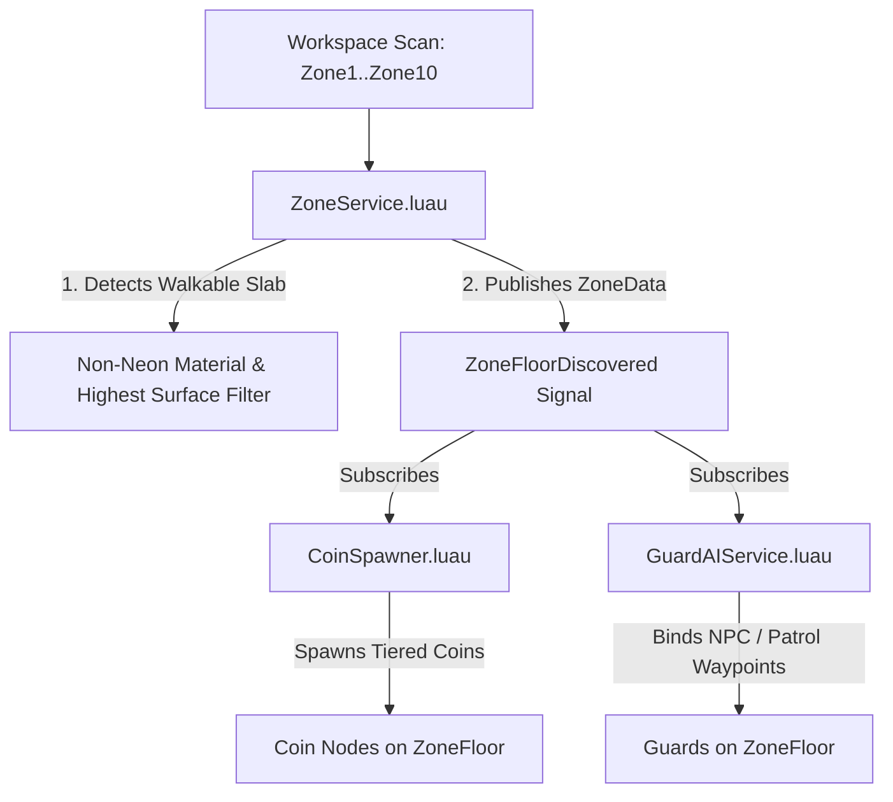

# System Specification 13: Tower Zone Discovery & Arena Pub/Sub Engine

**Status:** IMPLEMENTED  
**Location:** `src/server/Services/ZoneService.luau`  

---

## 1. Overview

The **Zone Service** acts as the single source of truth for Tower Zone discovery and walkable arena floor detection across the game's 10 Tower Zones (`Zone1_SunnyStart` to `Zone10_Hellfire`).

It uses an event-driven **Pub/Sub pattern** via `SignalModule`, replacing decoupled private scans in downstream services. Both [`CoinSpawner.luau`](file:///Users/ridhomfadlan/Documents/Roblox%20Files/dont-drop-the-coin/src/server/Services/CoinSpawner.luau) and [`GuardAIService.luau`](file:///Users/ridhomfadlan/Documents/Roblox%20Files/dont-drop-the-coin/src/server/Services/GuardAIService.luau) subscribe to `ZoneService.OnZoneFloorDiscovered` to spawn coins, waypoints, and guards simultaneously without race conditions.

---

## 2. Architecture & Data Flow



---

## 3. Data Structure: `ZoneData`

Every discovered floor emits a strongly-typed `ZoneData` payload:

```lua
export type ZoneData = {
    ZoneModel: Model,          -- Reference to the Zone Model (e.g. Zone1_SunnyStart)
    FloorSlab: BasePart,       -- Primary walkable floor slab (ZoneFloorSlab)
    ZoneTier: number,          -- Integer tier 1 through 10
    SurfaceCenter: Vector3,    -- Exact world center on the top surface of the slab
    UpwardNormal: Vector3,     -- Surface normal vector pointing upwards (0, 1, 0)
    TopSurfaceY: number,       -- Absolute Y elevation of the walkable surface
}
```

---

## 4. Smart Slab Surface Detection Algorithm

Tower zone models contain multiple decorative parts inside `ZoneFloor` (such as neon underglow trims, border plinths, and lighting fixtures). To ensure only the true walkable slab is selected:

1. **Collision Filter**: Only considers parts where `CanCollide = true`.
2. **Material Filter**: Prioritizes non-neon parts (`part.Material ~= Enum.Material.Neon`) to avoid selecting decorative neon underglow rings.
3. **Face Analysis (`getUpwardFaceData`)**: Computes dot products between part surface normal vectors and `Vector3.yAxis` to find the upward-facing surface.
4. **Elevation Selection**: Among candidate parts, selects the part with the highest upward surface elevation:
   $$\text{TopY} = \text{Position}_Y + (\text{Normal}_Y \times \text{NormalExtent})$$

---

## 5. Replay-Safe Subscription (`OnZoneFloorDiscovered`)

To eliminate race conditions between server service initialization orders:

```lua
function ZoneService.OnZoneFloorDiscovered(callback: (ZoneData) -> ()): SignalModule.Connection
    -- 1. Replay all already-discovered zones to the new subscriber immediately
    for _, zoneData in pairs(discoveredZones) do
        task.spawn(callback, zoneData)
    end

    -- 2. Connect to any future zones added dynamically at runtime
    return ZoneService.ZoneFloorDiscovered:Connect(callback)
end
```

Any service can subscribe at any point in the server lifecycle—whether before or after the initial workspace scan—and is guaranteed to receive all zone events.

---

## 6. Downstream Service Integration

### 1. Coin Spawner Integration ([`CoinSpawner.luau`](file:///Users/ridhomfadlan/Documents/Roblox%20Files/dont-drop-the-coin/src/server/Services/CoinSpawner.luau))
- Subscribes via `ZoneService.OnZoneFloorDiscovered`.
- Calculates grid spawn points across the slab surface using `Config.COIN_SPAWNER.ZONE_FLOOR_COIN_SPACING`.
- Spawns tiered coins at `ZONE_FLOOR_HOVER_HEIGHT = 2.0` studs above `TopSurfaceY`.

### 2. Guard AI Integration ([`GuardAIService.luau`](file:///Users/ridhomfadlan/Documents/Roblox%20Files/dont-drop-the-coin/src/server/Services/GuardAIService.luau))
- Subscribes via `ZoneService.OnZoneFloorDiscovered`.
- Resolves template definition from `Config.GUARD_TEMPLATES` and difficulty modifiers from `Config.ZONE_GUARDS`.
- Auto-generates inward perimeter waypoints inside circular/cylinder floor slabs.
- Binds `platformPart = zoneData.FloorSlab` to leash the guard's patrol and chase states to the floor arena.

---

## 7. Service Order in `Main.server.luau`

`ZoneService` is registered in `SERVICE_ORDER` before downstream consumers:

```lua
local SERVICE_ORDER = {
    "DataStoreManager",
    "StackServer",
    "CoinService",
    "ZoneService",      -- <--- Master zone discovery initialized first
    "CoinSpawner",      -- <--- Consumes ZoneFloorDiscovered
    "LootExplosion",
    "HitboxService",
    "DummySpawner",
    "BankServer",
    "CombatServer",
    "SettingsService",
    "GuardAIService",   -- <--- Consumes ZoneFloorDiscovered
    ...
}
```
