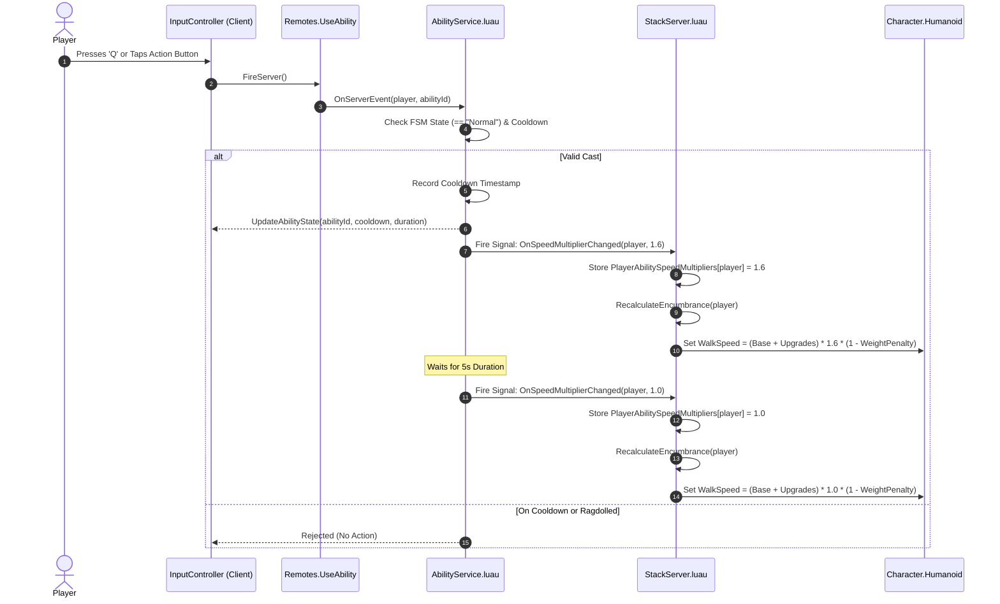

# 📄 SYSTEM 15: ABILITY & MODIFIER ARCHITECTURE

This document specifies the technical architecture, data-driven configuration, unidirectional pub/sub signal flow, and encumbrance integration for **Player Abilities and Modifiers** in **Don't Drop The Coin!**.

---

## 🎯 1. OBJECTIVES & PRINCIPLES

1. **Data-Driven Configuration**: Abilities, cooldowns, active durations, and stat multipliers are declared as plain data in `AbilityConfig.luau` rather than hardcoded in multiple game scripts.
2. **Unidirectional Pub/Sub Decoupling**: Systems communicate using typed signals (`SignalModule`) rather than circular `require()` loops or heavy runtime helper functions.
3. **Single Source of Truth for Physics**: `StackServer.luau` is the sole owner of `Humanoid.WalkSpeed` calculations, ensuring coin weight encumbrance, permanent shop upgrades, and temporary ability buffs cleanly multiply together without race conditions.
4. **Zero Attribute Bloat**: Temporary stat buffs are tracked in memory tables rather than string attributes on Roblox instances.
5. **Mobile & PC Parity**: Standardized network trigger via `Remotes.UseAbility` supporting keybinds (`Q` on PC) and on-screen HUD buttons on Mobile.

---

## 🏗️ 2. DIRECTORY ARCHITECTURE

```
src/
├── shared/
│   ├── Config/
│   │   └── AbilityConfig.luau       <-- Declarative registry of ability IDs, cooldowns, and multipliers
│   ├── Remotes.luau                 <-- Central network registry (UseAbility, UpdateAbilityState)
│   └── Utils/
│       └── PlayerFSM.luau           <-- Validates state preconditions (Normal state vs Ragdolled)
│
├── server/
│   ├── Main.server.luau             <-- Service startup orchestrator
│   └── Services/
│       ├── AbilityService.luau      <-- Validates cooldowns, triggers abilities, emits signals
│       ├── StackServer.luau         <-- Subscribes to speed multiplier signals; computes WalkSpeed
│       └── UpgradeService.luau      <-- Emits OnStatsChanged signal when shop upgrades are purchased
│
└── client/
    └── Controllers/
        └── InputController.luau     <-- Binds Key Q and Mobile Action button to Remotes.UseAbility
```

---

## 🔄 3. SIGNAL FLOW & SEQUENCE DIAGRAM



---

## ⚙️ 4. DATA SPECIFICATION (`AbilityConfig.luau`)

```luau
export type AbilityData = {
    Id: string,
    Name: string,
    Cooldown: number,
    Duration: number,
    SpeedMultiplier: number?,
    JumpMultiplier: number?,
    SoundId: string?,
}

local AbilityConfig: { [string]: AbilityData } = {
    ["speed_surge"] = {
        Id = "speed_surge",
        Name = "Speed Surge",
        Cooldown = 15,          -- 15 seconds cooldown
        Duration = 5,           -- 5 seconds active buff
        SpeedMultiplier = 1.6,  -- +60% WalkSpeed boost
        SoundId = "rbxassetid://9114223179",
    },
}
```

---

## 🧮 5. INTEGRATED WALKSPEED FORMULA

The final humanoid movement speed calculated inside `StackServer.luau` combines all three progression and buff factors:

$$\text{EffectiveBaseSpeed} = \big(\text{BaseSpeed} + \text{BonusSpeed}_{\text{Upgrade}}\big) \times \text{SpeedMultiplier}_{\text{Ability}}$$

$$\text{EffectiveWeight} = \text{TotalStackWeight} \times (1 - \text{WeightDiscount}_{\text{StrengthUpgrade}})$$

$$\text{FinalWalkSpeed} = \text{clamp}\Big(\text{EffectiveBaseSpeed} \times \big(1 - \text{EffectiveWeight} \times 0.02\big),\; 8,\; \text{EffectiveBaseSpeed}\Big)$$

---

## 🚀 6. SCALING TO FUTURE ABILITIES (DOMAIN ROUTING)

When adding future abilities (e.g., *Coin Magnet*, *Guard Freeze*, *Super Glue*), `AbilityService` routes the activation signal directly to the appropriate domain service without growing into a monolith:

| Ability | Target Domain Service | Interaction Mechanism |
| :--- | :--- | :--- |
| **Speed Surge / Jump** | `StackServer.luau` | `AbilityService.OnSpeedMultiplierChanged` |
| **Coin Magnet** | `CoinService.luau` | `CoinService.StartMagnet(player, radius, duration)` |
| **Guard Freeze** | `GuardAIService.luau` | `GuardAIService.FreezeGuardsInRadius(pos, radius, duration)` |
| **Super Glue (Knockback Immunity)** | `CombatServer.luau` | `CombatServer.SetKnockbackImmune(player, duration)` |
